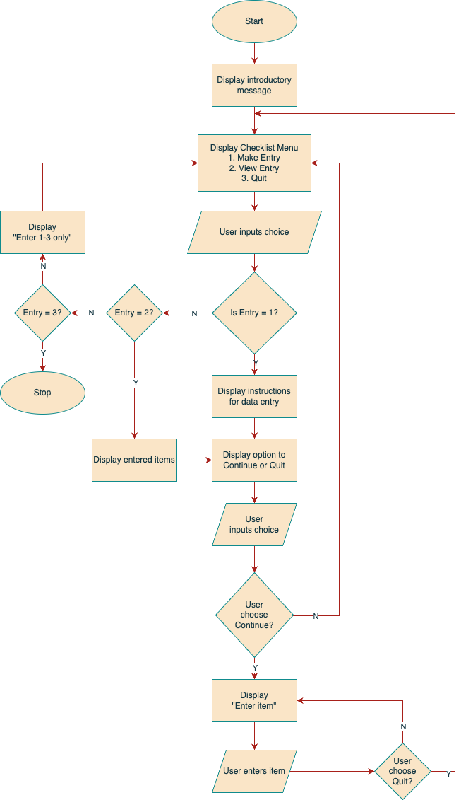

# Project: A Basic Travel Checklist app
#### Submitted as a part of T1A3 - Terminal Application assignment (Bootcamp course)
##### Date of commencement: Sunday, 10 December 2023
---
# Overview 

**Tech stack**  
Python

**GitHub Repository**  
https://github.com/emanoj1/terminal-application-t1a3-ca

---

**About**:  
The Travel Checklist is an app to keep track of all the things a traveller needs to carry with them for their travel.  

**App features**:  
<ol>
<li>Create entries of things to carry</li>
<li>View full list</li>
<li>Check completed list</li>
<li>Check pending list</li>
</ol>

---

**How will the app function**  
When the Python code is executed, the system will welcome the user, and provide the user with a numbered menu to choose from. If the user wishes to make a new entry, they will choose the option to make a new checklist and the system will proceed to ask him/her firstly their name, their travel destination, and the date of travel. Once these are stored, it will proceed to ask them to enter each items in a numbered manner. This will continue till the user quits, upon which it will thank them for the entries, and list the initial menus again. If the user wishes to ever track their completed or pending items of a list, they can do so by choosing the specific menu option.

**Flow chart**
Below is the logical flow of activities:

---

**Simple Pseudocode**  

This is a simple coding algorithm for the app functions:

Print intro Message:  
    "Welcome to the Travel Checklist!"  
    "Keep a track of what to take and don't miss a thing."

Print Menu items:  
"Main Menu - Choose an option:
1. Make new entry
2. View entries
3. Quit"

If menu_option == 1  
print "Enter your top 10 items to carry" 
Store entries into a set 
Print "Here is your travel list so far!
"1. item 1"
"2. item 2"
"Bon Voyage!

else if menu_option == 2
then check if entries == 0, print("Sorry, no entries available")
else print below:
"Here is your travel list so far!
"1. item 1"
"2. item 2"
"Bon Voyage"

if menu_option == 3, print "Thank you! See you soon!
come out of the program

if menu_option is inavlid entry, 
print "Invalid entry! Enter 1,2 or 3 only please"
print Menu items

---

